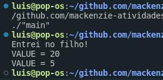

# lab-7

```c
#include <stdio.h>
#include <sys/types.h>
#include <unistd.h>
#include <sys/wait.h>

int value = 5;

int main()
{
    pid_t pid;
    pid = fork();
    if (pid == 0)
    { /* child process */
        printf("Entrei no filho!\n");
        value += 15;
        // return 0;
    }
    else if (pid > 0)
    { /* parent process */
        wait(NULL);
    }

    printf("VALUE = %d\n", value); /* LINE A */
    return 0;
}
```


