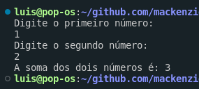
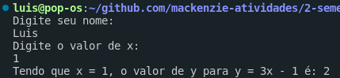
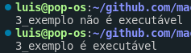
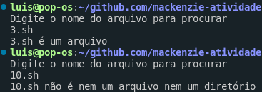
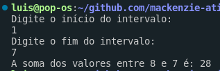

# Atividade Sistemas Operacionais

## 1. Soma

```sh
#!/bin/bash
echo "Digite o primeiro número:"
read num1

echo "Digite o segundo número:"
read num2

soma=$((num1 + num2))

echo "A soma dos dois números é: $soma"
```



## 2. Função entre valores

```sh
#!/bin/bash
echo "Digite seu nome:"
read nome

echo "Digite o valor de x:"
read x

y=$((3 * x - 1))

echo "Tendo que x = $x, o valor de y para y = 3x - 1 é: $y"
```



## 3. Teste executável

```sh
#!/bin/bash

if [ -x 3_exemplo.sh ]; then
  echo "3_exemplo é executável"
else
  echo "3_exemplo não é executável"
  chmod +x 3_exemplo.sh
fi
```



## 4. Teste arquivo ou diretório

```sh
#!/bin/bash

echo "Digite o nome do arquivo para procurar"
read arquivo

if [ -d "$arquivo" ]; then
  echo "$arquivo é um diretório"
  exit
fi

if [ -f "$arquivo" ]; then
  echo "$arquivo é um arquivo"
  exit
fi

echo "$arquivo não é nem um arquivo nem um diretório"
```



## 5. Exibir conteúdo

```sh
#!/bin/bash
echo "Digite o nome do arquivo para procurar"
read nome

if [ -d "$nome" ]; then
  echo "$nome é um diretório"
  echo "Conteúdo do diretório:"
  ls $nome
  exit
fi

if [ -f "$nome" ]; then
  echo "$nome é um arquivo"
  echo "Conteúdo:"
  cat $nome
  exit
fi

echo "$nome não é nem um arquivo nem um diretório"
```

![5.png]

## 6. Soma entre intervalos

```sh
#!/bin/bash

echo "Digite o início do intervalo:"
read inicio

echo "Digite o fim do intervalo:"
read fim

soma=0
while [ $inicio -le $fim ]; do
  soma=$((soma + inicio))
  inicio=$((inicio + 1))
done

echo "A soma dos valores entre $inicio e $fim é: $soma"
```


